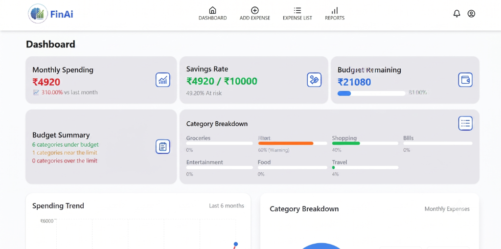
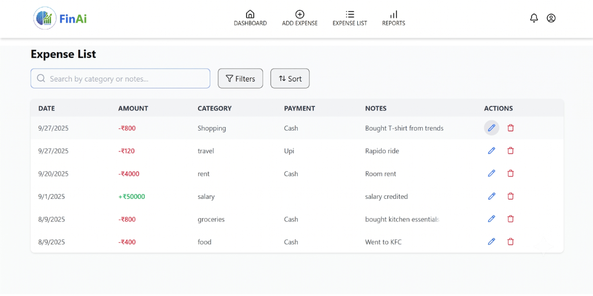
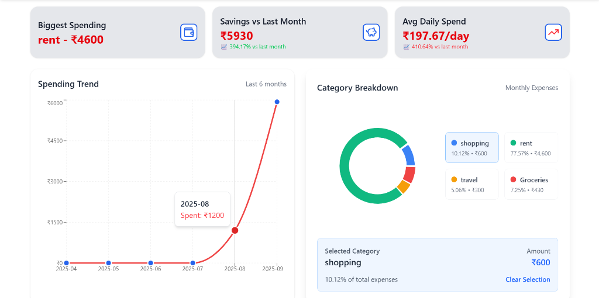

# 🏦 FinAI - AI-Powered Personal Expense Tracker

FinAI is a full-stack personal finance management platform designed to help users track expenses, set budgets, and receive actionable, AI-powered insights regarding their spending habits. It features a modern, responsive UI/UX, interactive data analytics, real-time notifications, and Google Gemini AI integrations for intelligent receipt processing (OCR) and smart financial advice.

Developed as a personal project by **Movendu Singh**.

---

## 📸 Screenshots

### 1. Smart Dashboard
Interactive financial metrics, monthly spending progress, budget alert meters, and spending trends at a glance.


### 2. Expense List
Detail-oriented transaction list with pagination, search, categorization, and edit/delete actions.


### 3. Detailed Reports & Charts
Interactive spending trends and category breakdown charts using Recharts.


---

## 🌟 Key Features

*   **💰 Smart Expense Management:** Add, edit, and categorize income/expenses. SupportsCash, UPI, and Card payments.
*   **🧠 AI-Powered Intelligence:** Uses **Google Gemini 2.5 Flash** for receipt processing (OCR) to automatically extract transaction details, and generates personalized weekly financial advice.
*   **🎯 Budget Management:** Set monthly budget thresholds and get real-time visual alerts (safe, warning, over limit) based on current spending.
*   **📊 Comprehensive Analytics:** Beautiful, interactive charts (income vs. expense, monthly category breakdowns, historical trends).
*   **🔔 Real-time Notifications:** In-app popups and system alerts powered by **Socket.io** for budget warnings and transaction updates.

---

## 🛠️ Tech Stack

### Frontend
- **React 19 & Vite** - High performance, modern UI rendering
- **TailwindCSS 4** - Modern CSS styling system
- **Recharts** - Dynamic, interactive data charts
- **Framer Motion** - Smooth page animations and micro-interactions
- **Redux Toolkit** - Application state management

### Backend & Database
- **Node.js & Express.js** - Robust backend REST API
- **MongoDB Atlas** - Cloud database for transaction and user accounts
- **JWT & bcryptjs** - Secure user authentication and password encryption
- **Google Generative AI SDK** - Gemini API integration for receipt scanning & insights
- **Multer** - Upload handling for receipt image files
- **Socket.io** - Real-time client-server websocket updates

---

## 🚀 Quick Start Guide

### Prerequisites
Make sure you have the following installed on your laptop:
- **Node.js** (v18 or higher)
- **npm** (comes with Node)
- **Git**
- An active internet connection (for Google Gemini API and MongoDB Atlas connection)

---

## ⚙️ Environment Setup

### 1. Database Connection (MongoDB Atlas)
1. Go to [MongoDB Atlas](https://www.mongodb.com/cloud/atlas) and sign up for a free account.
2. Build a free **M0 cluster** and create a database user (e.g., username: `move`).
3. Under **Network Access**, add `0.0.0.0/0` to your IP whitelist to allow connections from your laptop.
4. Click **Connect** -> **Drivers**, and copy the connection string.

### 2. Google Gemini API Key
1. Visit [Google AI Studio](https://aistudio.google.com/).
2. Click **Get API Key** and generate a new key.

### 3. Configuration Files (.env)

#### Backend Configuration
Create a `.env` file in the `/server` directory with the following variables:
```env
MONGO_URI=mongodb+srv://<username>:<password>@cluster0.xxxx.mongodb.net/?appName=finai-db
MONGODB_URL=mongodb+srv://<username>:<password>@cluster0.xxxx.mongodb.net/?appName=finai-db
JWT_SECRET=finai_super_secret_jwt_key_2026
GEMINI_API_KEY=your_google_gemini_api_key_here
PORT=8001
NODE_ENV=development
CLIENT_URL=http://localhost:5173
```
*(Replace `<username>` and `<password>` with your Atlas credentials).*

#### Frontend Configuration
Create a `.env` file in the `/client` directory:
```env
VITE_API_URL=http://localhost:8001/api
VITE_SERVER_URL=http://localhost:8001
```

---

## 🏃‍♂️ How to Run the Application

### Step 1: Install Dependencies
Open a command prompt in the project root and install dependencies for both components:

```bash
# Install backend packages
cd server
npm install

# Install frontend packages
cd ../client
npm install
```

### Step 2: Run the Application
You need to start both the backend API server and frontend development server concurrently using two terminal windows.

**Terminal 1 (Backend Server):**
```bash
cd server
npm run dev
```

**Terminal 2 (Frontend Client):**
```bash
cd client
npm run dev
```

The frontend application will boot up at **[http://localhost:5173/](http://localhost:5173/)**. Open this link in your browser to start tracking your finances!
